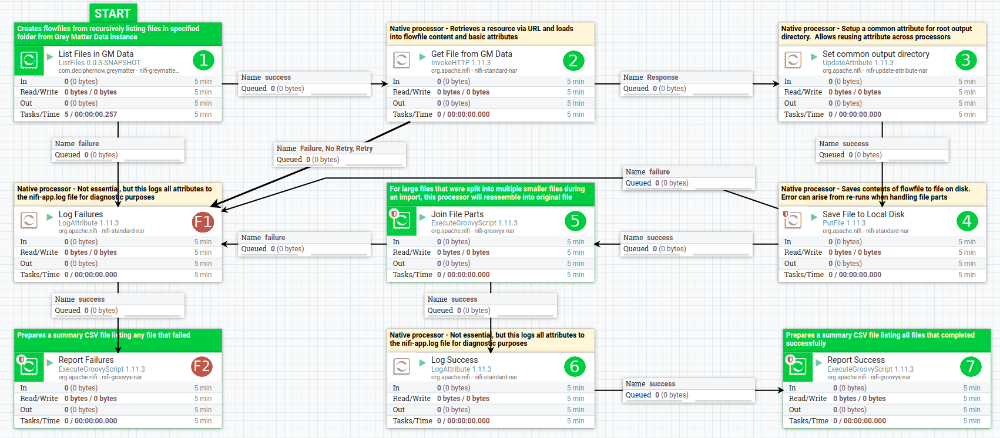

# Grey Matter Data to File System

The template for transferring files from an instance of Grey Matter Data to the File System.

## Template Location

Download template for [Grey Matter Data to File System](../../nifi-templates/Recreate_File_System_from_GMData.xml)

## Flow visualization

## Steps

---

### 1. List Files in GM Data

**Description**: Creates flow files based upon files in designated path of Grey Matter with optional recursive handling and filtering.

**Custom Processor**: [com.deciphernow.greymatter.ListFiles](../ListFiles.md)

**Key Configuration to Adjust**:

- _Remote Url_ - As the name implies, this endpoint should be changed to reflect the root of the Grey Matter Data instance for which this processor will interrogate to retrieve files.  The default value in the template is actually traversing through a proxy that will supersede the USER_DN value.

- _SSL Context Service_ - When communicating with Grey Matter Data, a client keystore and trust store may be established.  A valid PKI certificate will be needed to list files and folders in Grey Matter Data.

- _Input Directory_ - The template defaults to `/1/world/nifinpe@example.com/demo/2020-06-08/files`. This most definitely will need to be changed for your specific use case but can be helpful in building up the path you want to use.  There are effectively three segments to this directory path described below.
  - World Path - (required) Example: `/1/world`. This may always be found using the OID 1 and world.  You can always use `/1/world` to satisfy this portion of the path
  - User Folder - (optional) Example: `/nifinpe@example.com`. A Grey Matter instance has user folders for each user with privileges to create content. The default is typically either based upon a user's email address or subject distinguished name. This information is available at the /config endpoint of the Remote Url.  
  - Folder Path - (optional) Example: `/demo/2020-06-08/files`. This is the path underneath the user folder for which files will be listed.

- _Recurse Subdirectories_ - The template defaults to `true`.  This is most likely the scenario you will want but worth noting to consider in edge cases.  

- _USER_DN_ - This dynamic property is prepopulated with a subject distinguished name from the certificate to use for identity.  The same will be populated and overwritten automatically when communicating with Grey Matter Data through an edge proxy.  This value only needs to be set when communicating directly to Grey Matter Data without an intermediary.

---

### 2. Get File From GM Data

**Description**: Retrieves a resource via URL and loads into flowfile content and basic attributes

**Native Processor**: [org.apache.nifi.InvokeHTTP](https://nifi.apache.org/docs/nifi-docs/components/org.apache.nifi/nifi-standard-nar/1.11.4/org.apache.nifi.processors.standard.InvokeHTTP/index.html)

**Key Configuration to Adjust**:

- _Remote Url_ - This endpoint should point to the actual URL of the file to be retrieved.  The prior step sets a flowfile attribute named gmdata.oid that can be referenced.  The default value here most likely just needs the host IP address or fully qualified distinguished name (FQDN) and base path to the service changed.  At this time, the value specified here should be in the format of  `https://{name-or-address}:{port}/{path-to-grey-matter-data}/stream/${gmdata.oid}`

- _SSL Context Service_ - When communicating with Grey Matter Data, a client keystore and trust store may be established.  A valid PKI certificate will be needed to download files from Grey Matter Data.

- _USER_DN_ - This dynamic property is prepopulated with a subject distinguished name from the certificate to use for identity.  The same will be populated and overwritten automatically when communicating with Grey Matter Data through an edge proxy.  This value only needs to be set when communicating directly to Grey Matter Data without an intermediary.

---

### 3. Set common output directory

**Description**: This establishes a common attribute for root output directory.

**Native Processor**: [org.apache.nifi.UpdateAttribute](https://nifi.apache.org/docs/nifi-docs/components/org.apache.nifi/nifi-update-attribute-nar/1.11.4/org.apache.nifi.processors.attributes.UpdateAttribute/index.html)

**Key Configuration to Adjust**:

- _baseOutputDirectory_ - This attribute defines the root path to use for files when downloaded and will be used in subsequent processors to Join File Parts, Report Falures and Report Success.  The NiFi processor must have read and write privileges to this path.

---

### 4. Save File to Local Disk

**Description**:  Saves contents of flowfile to file on disk.

**Native Processor**: [org.apache.nifi.PutFile](https://nifi.apache.org/docs/nifi-docs/components/org.apache.nifi/nifi-standard-nar/1.11.4/org.apache.nifi.processors.standard.PutFile/index.html)

**Key Configuration to Adjust**:

In general, no adjustment is necessary from default configuration.

At this time, if this flowfile template is run multiple times on the same input set and involves files that need to be rejoined, then an error will arise on subsequent runs due to mismatch between file and folder types when handling split files.  

---

### 5. Join File Parts

**Description**: For large files that were split into multiple smaller files during an import, this processor will reassemble into original file.  

**Native Processor**: [org.apache.nifi.ExecuteGroovyScript](https://nifi.apache.org/docs/nifi-docs/components/org.apache.nifi/nifi-groovyx-nar/1.11.4/org.apache.nifi.processors.groovyx.ExecuteGroovyScript/index.html) with Custom Script [Join Files From 4GB Parts](../JoinFiles.md)

**Key Configuration to Adjust**:

- _Script Body_ - The following `Configurable Variables` at the top of the script can be altered

  - fps - This is the file part size.  This should match the same sized used for splitting files during an import.  The default is `4G`

---

### 6. Log Success

**Description**: Logs all attributes to the nifi-app.log for diagnostic purposes

**Native Processor**: [org.apache.nifi.LogAttribute](https://nifi.apache.org/docs/nifi-docs/components/org.apache.nifi/nifi-standard-nar/1.11.4/org.apache.nifi.processors.standard.LogAttribute/index.html)

**Key Configuration to Adjust**:

In general, no adjustment is necessary from default configuration.

In a production setting, you may want to eliminate this processing step altogether.

---

### 7. Report Success

**Description**: Prepares a summary CSV file listing all files that completed successfully

**Native Processor**: [org.apache.nifi.ExecuteGroovyScript](https://nifi.apache.org/docs/nifi-docs/components/org.apache.nifi/nifi-groovyx-nar/1.11.4/org.apache.nifi.processors.groovyx.ExecuteGroovyScript/index.html) with Custom Script [File Summary Report](../FileSummaryReport.md)

**Key Configuration to Adjust**:

- _Script Body_ - The following `Configurable Variables` at the top of the script can be altered

  - csvfile - Where the output file should be saved. The default is `/home/nifi/reports/export-success.csv`

---
## Failure Steps

### F1. Log Failures

**Description**: Logs all attributes to the nifi-app.log for diagnostic purposes

**Native Processor**: [org.apache.nifi.LogAttribute](https://nifi.apache.org/docs/nifi-docs/components/org.apache.nifi/nifi-standard-nar/1.11.4/org.apache.nifi.processors.standard.LogAttribute/index.html)

**Key Configuration to Adjust**:

In general, no adjustment is necessary from default configuration.

In a production setting, you may want to eliminate this processing step altogether.

---

### F2. Report Failures

**Description**: Prepares a summary CSV file listing all files that failed to complete

**Native Processor**: [org.apache.nifi.ExecuteGroovyScript](https://nifi.apache.org/docs/nifi-docs/components/org.apache.nifi/nifi-groovyx-nar/1.11.4/org.apache.nifi.processors.groovyx.ExecuteGroovyScript/index.html) with Custom Script [File Summary Report](../FileSummaryReport.md)

**Key Configuration to Adjust**:

- _Script Body_ - The following `Configurable Variables` at the top of the script can be altered

  - csvfile - Where the output file should be saved. The default is `/home/nifi/reports/export-failure.csv`