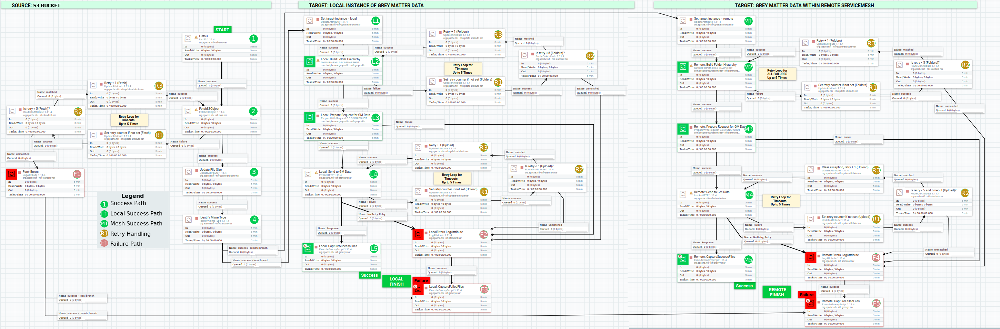

# S3 to Grey Matter Data

The template for transferring files from an AWS S3 bucket to Grey Matter data.
Grey Matter Data destinations in this template are hosted both locally and in the service mesh.

## Template Location

Download template for [Upload S3 to Grey Matter Data](../../nifi-templates/S3_to_GM_Data_Local_and_remote.xml)

## Flow visualization

## Steps

---
### 1. List Files in S3

**Description**: List the files in an S3 bucket

**Native Processor**: [org.apache.nifi.processors.aws](https://nifi.apache.org/docs/nifi-docs/components/org.apache.nifi/nifi-aws-nar/1.11.4/org.apache.nifi.processors.aws.s3.ListS3/index.html)

**Key Configuration to Adjust**:
- _Bucket_ - The AWS S3 bucket that contains the files.
- _Region_ - The AWS region that the S3 bucket is in.
- _Access Key ID_ - Access key that has at least read access to the bucket.
- _Secret Access Key ID_ - Secret Access key that has at least read access to the bucket.

---
### 2. Fetch Files From S3

**Description**: Fetch the full files from S3.

**Native Processor**: [org.apache.nifi.processors.aws](https://nifi.apache.org/docs/nifi-docs/components/org.apache.nifi/nifi-aws-nar/1.11.4/org.apache.nifi.processors.aws.s3.FetchS3Object/index.html)

**Key Configuration to Adjust**:
- _Bucket_ - The AWS S3 bucket that contains the files.
- _Region_ - The AWS region that the S3 bucket is in.
- _Access Key ID_ - Access key that has at least read access to the bucket.
- _Secret Access Key ID_ - Secret Access key that has at least read access to the bucket.

### 3. Update File Size

**Description**: Update the `file.size` attribute to be the same as `s3.length` for consistent logging.

**Native Processor**: [org.apache.nifi.UpdateAttribute](https://nifi.apache.org/docs/nifi-docs/components/org.apache.nifi/nifi-update-attribute-nar/1.11.4/org.apache.nifi.processors.attributes.UpdateAttribute/index.html)

In general, no adjustment is necessary from default configuration and may not be needed in a production environment.
This is not explicitly required but makes for nicer logging reports.

---
### 4. Identify Mime Type

**Description**: Assigns mime.type attribute based upon the mime type detected from file content or file name. 

**Native Processor**: [org.apache.nifi.IdentifyMimeType](https://nifi.apache.org/docs/nifi-docs/components/org.apache.nifi/nifi-standard-nar/1.11.4/org.apache.nifi.processors.standard.IdentifyMimeType/index.html)

**Key Configuration to Adjust**:
In general, no adjustment is necessary from default configuration.

---
## Local path

### L1. Set target-instance = local

**Description**: Set the flow file attribute `target-instance` to `local`. This is not explicitly required but makes for nicer logging reports.

**Native Processor**: [org.apache.nifi.UpdateAttribute](https://nifi.apache.org/docs/nifi-docs/components/org.apache.nifi/nifi-update-attribute-nar/1.11.4/org.apache.nifi.processors.attributes.UpdateAttribute/index.html)

**Key Configuration to Adjust**:
In general, no adjustment is necessary from default configuration.

---
### L2. Local: Build Folder Hierarchy

**Description**: Creates user folder, any optional intermediate prefix folders, and the folders that make up the path to the file.

**Custom Processor**: [com.deciphernow.greymatter.GetOidForPath](../GetOidForPath.md)

**Key Configuration to Adjust**:
- _Object Policy_ - The default setting in the template grants full permissions to a user having nifinpe@example.com email address, as well as read, execute, and create privileges to everyone else.  Most implementations will want to use a robust object policy tailored to the given use case, and in conjuction with properties Userfield Folder Object Policy, and Intermediate Folder Object Policy.
- _Original Object Policy_ - The template effectively leaves this as the default setting which will yield an empty policy.  For integrations that are migrating data, this field is intended to store a value representative of an originating access control policy in JSON format.  Similarly, the properties Userfield Folder Original Object Policy and Intermediate Folder Original Object Policy are worth attention.
- _Security_ - The default labels for this, along with Userfield Folder Security and Intermediate Folder Security should be tailored accordingly to represent an overall label for that level of the folder hierarchy and coloring for user interface purposes.  
- _Remote URL_ - As the name implies, this endpoint should be changed to reflect the root of the Grey Matter Data instance for which this processor will interrogate to create folder hierarchy.  The default value in the template is actually traversing through a proxy that will supersede the USER_DN value.
- _SSL Context Service_ - When communicating with Grey Matter Data, a client keystore and trust store may be established.  A valid PKI certificate will be needed to upload files into Grey Matter Data.
- _USER_DN_ - This dynamic property is pre-populated with a subject distinguished name from the certificate to use for identity.  The same will be populated and overwritten automatically when communicating with Grey Matter Data through an edge proxy.  This value only needs to be set when communicating directly to Grey Matter Data without an intermediary.

---
### L3. Local: Prepare Request for GM Data

**Description**: Transform file to multipart/form-data request and assembles JSON representation of metadata.

**Custom Processor**: [com.deciphernow.greymatter.PrepareWriteRequest](../PrepareWriteRequest.md)

**Key Configuration to Adjust**:
- _Object Policy_ - The default setting in the template grants full permissions to a user having nifinpe@example.com email address, as well as read only permissions to everyone else.  Most implementations will want to use a robust object policy tailored to the given use case.
- _Security_ - The default labels for this should be tailored accordingly to represent an overall label for the file being uploaded and coloring for user interface purposes.
- _Custom_ - The default value for this is an example only, and most production purposes will either want to clear this, or populate a custom json structure.
- _Folder Object ID_ - This is the parent ID for the files to be uploaded to. In general it can stay as `${gmdata.parentoid}` but may be changed if there is a different destination in mind

---
### L4. Local: Send to GM Data

**Description**: Send the prepared HTTP request to GM Data. Successful response is JSON which could be further processed.

**Native Processor**: [org.apache.nifi.InvokeHTTP](https://nifi.apache.org/docs/nifi-docs/components/org.apache.nifi/nifi-standard-nar/1.11.4/org.apache.nifi.processors.standard.InvokeHTTP/index.html)

**Key Configuration to Adjust**:
- _Remote URL_ - The Remote URL for the Grey Matter Data service that the file should be uploaded to.  This should be based upon the same Remote URL used for Building the Folder Hierarchy. At this time, the value specified here should be in the format of  `https://{name-or-address}:{port}/{path-to-grey-matter-data}/write`
- _SSL Context Service_ - When communicating with Grey Matter Data, a client keystore and trust store may be established.  A valid PKI certificate will be needed to upload files into Grey Matter Data. 
- _Content-Type_ - Expects the flowfile attribute to be set for ${mime.type}, which originated in step named 'Identify Mime Type'
- _USER_DN_ - This dynamic property is pre-populated with a subject distinguished name from the certificate to use for identity.  The same will be populated and overwritten automatically when communicating with Grey Matter Data through an edge proxy.  This value only needs to be set when communicating directly to Grey Matter Data without an intermediary.

---
### L5. Local-CaptureSuccessFiles

**Description**: Prepares a summary CSV file listing all files that completed successfully

**Native Processor**: [org.apache.nifi.ExecuteGroovyScript](https://nifi.apache.org/docs/nifi-docs/components/org.apache.nifi/nifi-groovyx-nar/1.11.4/org.apache.nifi.processors.groovyx.ExecuteGroovyScript/index.html) with Custom Script [File Summary Report](../FileSummaryReport.md)

**Key Configuration to Adjust**:

- _Script Body_ - The following `Configurable Variables` at the top of the script can be altered

  - csvfile - Where the output file should be saved. The default is `/home/nifi/reports/export-success.csv`

---
## Remote path

### M1. Set target-instance = remote

**Description**: Set the flow file attribute `target-instance` to `remote`. This is not explicitly required but makes for nicer logging reports.

**Native Processor**: [org.apache.nifi.UpdateAttribute](https://nifi.apache.org/docs/nifi-docs/components/org.apache.nifi/nifi-update-attribute-nar/1.11.4/org.apache.nifi.processors.attributes.UpdateAttribute/index.html)

**Key Configuration to Adjust**:
In general, no adjustment is necessary from default configuration.

---
### M2. Remote: Build Folder Hierarchy

**Description**: Creates user folder, any optional intermediate prefix folders, and the folders that make up the path to the file.

**Custom Processor**: [com.deciphernow.greymatter.GetOidForPath](../GetOidForPath.md)

**Key Configuration to Adjust**:
- _Object Policy_ - The default setting in the template grants full permissions to a user having nifinpe@example.com email address, as well as read, execute, and create privileges to everyone else.  Most implementations will want to use a robust object policy tailored to the given use case, and in conjuction with properties Userfield Folder Object Policy, and Intermediate Folder Object Policy.
- _Original Object Policy_ - The template effectively leaves this as the default setting which will yield an empty policy.  For integrations that are migrating data, this field is intended to store a value representative of an originating access control policy in JSON format.  Similarly, the properties Userfield Folder Original Object Policy and Intermediate Folder Original Object Policy are worth attention.
- _Security_ - The default labels for this, along with Userfield Folder Security and Intermediate Folder Security should be tailored accordingly to represent an overall label for that level of the folder hierarchy and coloring for user interface purposes.  
- _Remote URL_ - As the name implies, this endpoint should be changed to reflect the root of the Grey Matter Data instance for which this processor will interrogate to create folder hierarchy.  The default value in the template is actually traversing through a proxy that will supersede the USER_DN value.
- _SSL Context Service_ - When communicating with Grey Matter Data, a client keystore and trust store may be established.  A valid PKI certificate will be needed to upload files into Grey Matter Data.
- _USER_DN_ - This dynamic property is prepopulated with a subject distinguished name from the certificate to use for identity.  The same will be populated and overwritten automatically when communicating with Grey Matter Data through an edge proxy.  This value only needs to be set when communicating directly to Grey Matter Data without an intermediary.

---
### M3. Remote: Prepare Request for GM Data

**Description**: Transform file to multipart/form-data request and assembles JSON representation of metadata.

**Custom Processor**: [com.deciphernow.greymatter.PrepareWriteRequest](../PrepareWriteRequest.md)

**Key Configuration to Adjust**:
- _Object Policy_ - The default setting in the template grants full permissions to a user having nifinpe@example.com email address, as well as read only permissions to everyone else.  Most implementations will want to use a robust object policy tailored to the given use case.
- _Security_ - The default labels for this should be tailored accordingly to represent an overall label for the file being uploaded and coloring for user interface purposes.
- _Custom_ - The default value for this is an example only, and most production purposes will either want to clear this, or populate a custom json structure.

---
### M4. Remote: Send to GM Data

**Description**: Send the prepared HTTP request to GM Data. Successful response is JSON which could be further processed.

**Native Processor**: [org.apache.nifi.InvokeHTTP](https://nifi.apache.org/docs/nifi-docs/components/org.apache.nifi/nifi-standard-nar/1.11.4/org.apache.nifi.processors.standard.InvokeHTTP/index.html)

**Key Configuration to Adjust**:
- _Remote URL_ - The Remote URL for the Grey Matter Data service that the file should be uploaded to.  This should be based upon the same Remote URL used for Building the Folder Hierarchy. At this time, the value specified here should be in the format of  `https://{name-or-address}:{port}/{path-to-grey-matter-data}/write`
- _SSL Context Service_ - When communicating with Grey Matter Data, a client keystore and trust store may be established.  A valid PKI certificate will be needed to upload files into Grey Matter Data. 
- _Content-Type_ - Expects the flowfile attribute to be set for ${mime.type}, which originated in step named 'Identify Mime Type'
- _USER_DN_ - This dynamic property is pre-populated with a subject distinguished name from the certificate to use for identity.  The same will be populated and overwritten automatically when communicating with Grey Matter Data through an edge proxy.  This value only needs to be set when communicating directly to Grey Matter Data without an intermediary.

---
### M5. Remote: CaptureSuccessFiles

**Description**: Prepares a summary CSV file listing all files that completed successfully.

**Native Processor**: [org.apache.nifi.ExecuteGroovyScript](https://nifi.apache.org/docs/nifi-docs/components/org.apache.nifi/nifi-groovyx-nar/1.11.4/org.apache.nifi.processors.groovyx.ExecuteGroovyScript/index.html) with Custom Script [File Summary Report](../FileSummaryReport.md)

**Key Configuration to Adjust**:

- _Script Body_ - The following `Configurable Variables` at the top of the script can be altered.

  - csvfile - Where the output file should be saved. The default is `/home/nifi/reports/export-success.csv`

---
## Retry Loops

### R1. Set retry counter if not set (Folders)
**Description**: If there is not a retry counter in the flowfile, set one to zero.

**Native Processor**: [org.apache.nifi.UpdateAttribute](https://nifi.apache.org/docs/nifi-docs/components/org.apache.nifi/nifi-update-attribute-nar/1.11.4/org.apache.nifi.processors.attributes.UpdateAttribute/index.html)

In general, no adjustment is necessary from default configuration.

---
### R2. Is retry < 5 (Folders)?

**Description**: If there have been too many retries, route to failure based on the retry counter.

**Native Processor**: [org.apache.nifi.RouteOnAttribute](https://nifi.apache.org/docs/nifi-docs/components/org.apache.nifi/nifi-standard-nar/1.11.4/org.apache.nifi.processors.standard.RouteOnAttribute/index.html)

In general, no adjustment is necessary from default configuration.

---
### R3. Retry + 1 (Folders)

**Description**: Increment the retry counter by 1.

**Native Processor**: [org.apache.nifi.UpdateAttribute](https://nifi.apache.org/docs/nifi-docs/components/org.apache.nifi/nifi-update-attribute-nar/1.11.4/org.apache.nifi.processors.attributes.UpdateAttribute/index.html)

In general, no adjustment is necessary from default configuration.

---
## Failure Steps

### F1. Fetch Errors

**Description**: Logs all attributes to the nifi-app.log for diagnostic purposes.

**Native Processor**: [org.apache.nifi.LogAttribute](https://nifi.apache.org/docs/nifi-docs/components/org.apache.nifi/nifi-standard-nar/1.11.4/org.apache.nifi.processors.standard.LogAttribute/index.html)

**Key Configuration to Adjust**:

In general, no adjustment is necessary from default configuration.

In a production setting, you may want to eliminate this processing step altogether.

---
### F2. Local: GM Data Errors

**Description**: Logs all attributes for failures in connecting or getting data into GM Data to the nifi-app.log for diagnostic purposes.

**Native Processor**: [org.apache.nifi.LogAttribute](https://nifi.apache.org/docs/nifi-docs/components/org.apache.nifi/nifi-standard-nar/1.11.4/org.apache.nifi.processors.standard.LogAttribute/index.html)

**Key Configuration to Adjust**:

In general, no adjustment is necessary from default configuration.

In a production setting, you may want to eliminate this processing step altogether.

---
### F3. Local: CaptureFailedFiles

**Description**: Prepares a summary CSV file listing all files that failed to complete. [Groovy script](../../nifi-script-processors/FileSummaryReport.groovy)

**Native Processor**: [org.apache.nifi.ExecuteGroovyScript](https://nifi.apache.org/docs/nifi-docs/components/org.apache.nifi/nifi-groovyx-nar/1.11.4/org.apache.nifi.processors.groovyx.ExecuteGroovyScript/index.html) with Custom Script [File Summary Report](../FileSummaryReport.md)

**Key Configuration to Adjust**:

- _Script Body_ - The following `Configurable Variables` at the top of the script can be altered.

  - csvfile - Where the output file should be saved. The default is `/home/nifi/reports/export-failure.csv`.

---
### F4. RemoteErrors-LogAttribute

**Description**: Logs all attributes for failures in connecting or getting data into GM Data to the nifi-app.log for diagnostic purposes.

**Native Processor**: [org.apache.nifi.LogAttribute](https://nifi.apache.org/docs/nifi-docs/components/org.apache.nifi/nifi-standard-nar/1.11.4/org.apache.nifi.processors.standard.LogAttribute/index.html)

**Key Configuration to Adjust**:

In general, no adjustment is necessary from default configuration.

In a production setting, you may want to eliminate this processing step altogether.

---
### F5. Remote: CaptureFailedFiles

**Description**: Prepares a summary CSV file listing all files that failed to complete. [Groovy script](../../nifi-script-processors/FileSummaryReport.groovy)

**Native Processor**: [org.apache.nifi.ExecuteGroovyScript](https://nifi.apache.org/docs/nifi-docs/components/org.apache.nifi/nifi-groovyx-nar/1.11.4/org.apache.nifi.processors.groovyx.ExecuteGroovyScript/index.html) with Custom Script [File Summary Report](../FileSummaryReport.md)

**Key Configuration to Adjust**:

- _Script Body_ - The following `Configurable Variables` at the top of the script can be altered.

  - csvfile - Where the output file should be saved. The default is `/home/nifi/reports/export-failure.csv`
